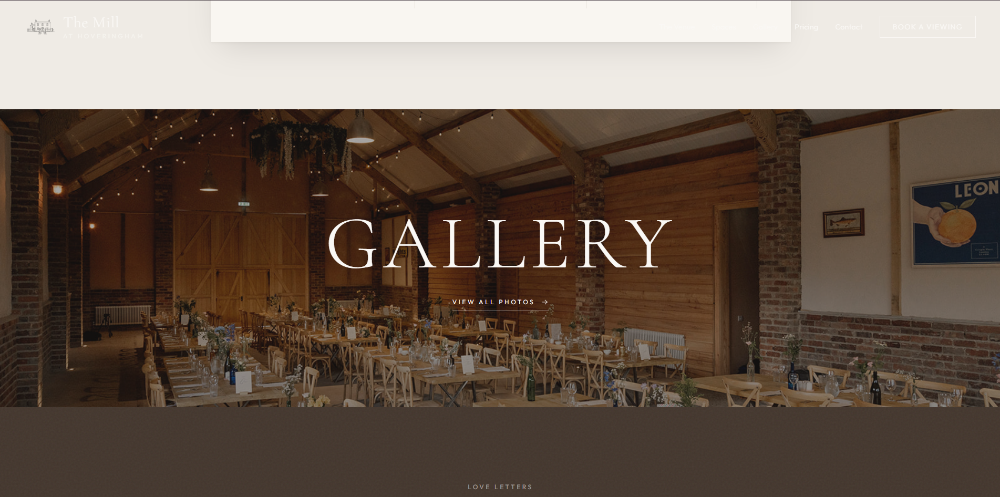
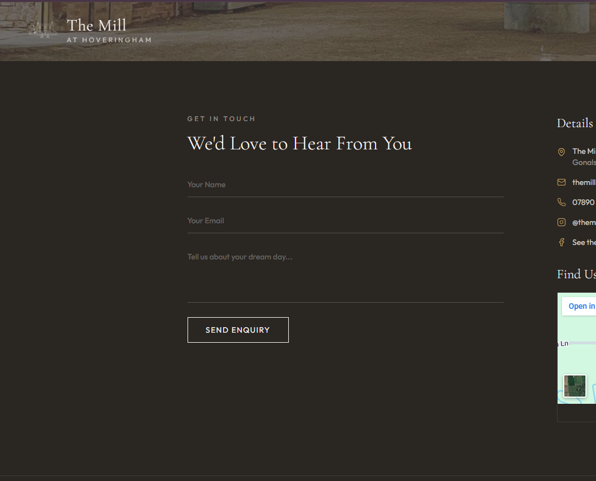
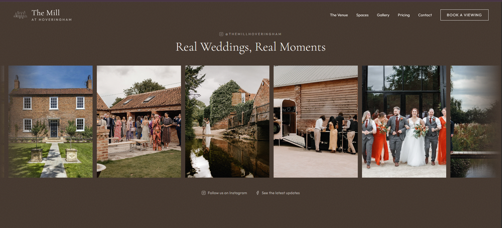

# themill-website-showcase

# The Mill at Hoveringham - Website Showcase

A cinematic luxury hospitality website concept currently being developed locally using VS Code, GitHub, and modern AI-assisted development workflows.

The project focuses on creating a refined editorial-style digital experience inspired by premium wedding venues, boutique hospitality brands, and modern interactive web design. The aim is to combine elegant typography, immersive imagery, smooth motion effects, and responsive layouts into a visually distinctive experience that feels both modern and timeless.

---

## Project Overview

The website is currently being developed and tested within a localhost environment using VS Code, modern front-end tooling, and iterative AI-supported development workflows, while design iterations, responsiveness, and interactive elements continue to be refined prior to deployment.

This repository serves as a public showcase of the design direction, user experience, animations, and creative development process. Source code is intentionally kept private while the project remains in active development.

---

## Design Direction

- Editorial-inspired layouts
- Minimal luxury aesthetic
- Cinematic scrolling interactions
- Smooth transitions and motion effects
- Large-format immersive imagery
- Mobile responsive optimisation
- High-end hospitality and wedding venue inspiration

---

## Development Workflow

Built and refined using:
- VS Code
- GitHub version control
- Localhost development environment
- AI-assisted prototyping and iteration workflows
- Responsive UI/UX testing
- Interactive animation experimentation

---

# Website Previews

## Front Page Concepts

---

## Venue & Experience Sections

---

## Booking & Interactive Sections

---

## Tour Experience Examples

---

# Motion & Interaction Previews

## Areas of The Mill
[Watch video](videos/Areas%20of%20The%20Mill.mp4)

## Begin the Tour
[Watch video](videos/Begin%20the%20tour.mp4)

## Front Page Effects
[Watch video](videos/Front%20Page%20Effects.mp4)

## Love Letters Animation
[Watch video](videos/Love%20Letters%20.mp4)

## Scroll Effect Photos
[Watch video](videos/Scroll%20effect%20photos.mp4)

---

## Current Status

🚧 In Active Development

Planned future additions may include:
- Cinematic walkthrough integrations
- Drone footage implementation
- Expanded interactive storytelling sections
- Enhanced motion and scroll animations
- Performance optimisation prior to deployment
